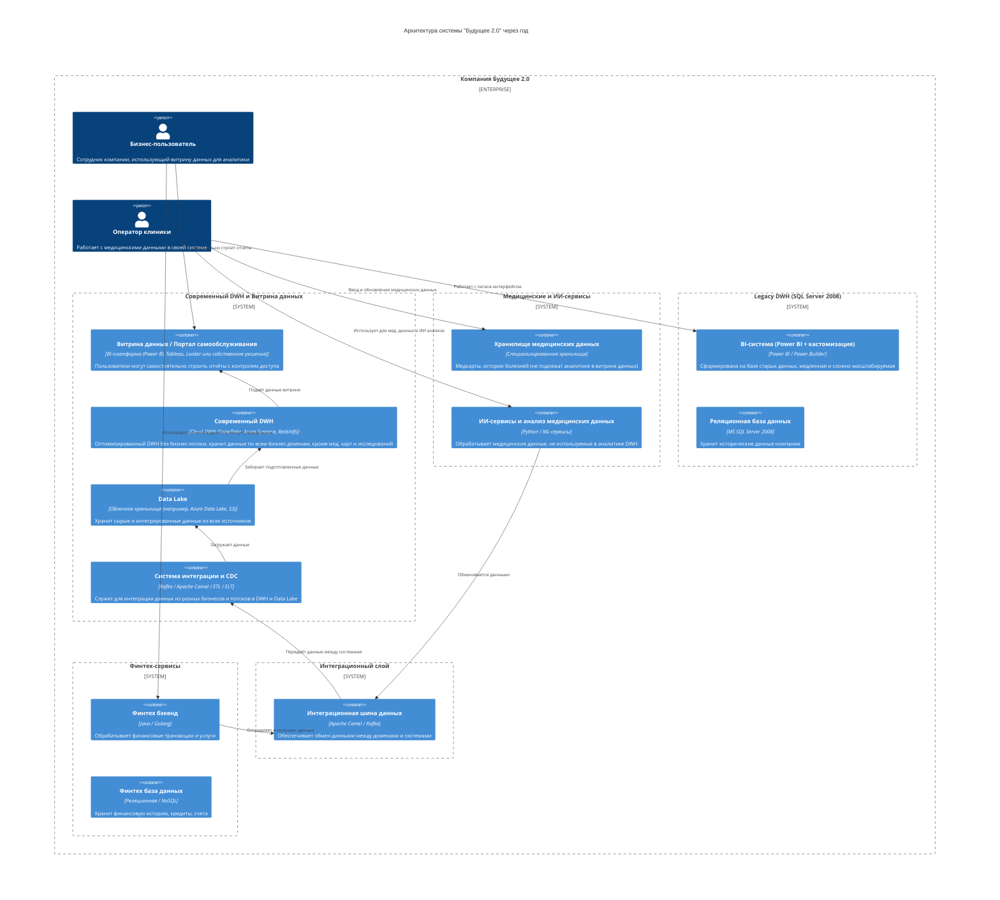

# Задание 1

## Архитектура системы через год

## Проблемные места

| №  | Проблема                                              | Описание для бизнеса                                                                                                  |
|----|------------------------------------------------------|----------------------------------------------------------------------------------------------------------------------|
| 1  | Легаси DWH на SQL Server 2008                        | Устаревшая платформа, медленная работа, сложное масштабирование и высокая нагрузка из-за бизнес-логики в базе данных. |
| 2  | Смешение бизнес-логики и хранения данных             | Много бизнес-логики реализовано в DWH, что затрудняет добавление новых бизнесов и замедляет время выхода на рынок.    |
| 3  | Недостаточная масштабируемость и производительность  | Сотни ТБ данных приводят к долгому времени построения отчётов (часы ожидания).                                       |
| 4  | Отсутствие современного портала самообслуживания     | Бизнес-пользователи ограничены в самостоятельном доступе к данным и создании отчётов, что снижает agility бизнеса.     |
| 5  | Интеграция нескольких бизнес-доменов без единого плана | Нет чёткой доменной модели и разделения ответственности, что приводит к большому количеству кастомной логики.       |
| 6  | Медицинские данные не интегрированы в аналитический DWH | Медкарты и ИИ-сервисы работают отдельно, что ограничивает возможность сквозного анализа, но это целенаправленно.     |

## Приоритизация проблем (MoSCoW)

| Категория  | Проблемы                                                                    |
|------------|-----------------------------------------------------------------------------|
| Must       | 1, 2, 3, 4 — требуется обновление платформы и архитектуры для повышения производительности, масштабируемости и удобства |
| Should     | 5 — проработать доменную модель и интеграцию новых бизнесов с минимальными кастомизациями                                     |
| Could      | 6 — интегрировать мед. данные в аналитическую систему (возможна в будущем, но не критично сейчас)                            |
| Won't      | Нет проблем, которые можно отложить в долгий ящик на данном этапе                                                               |
