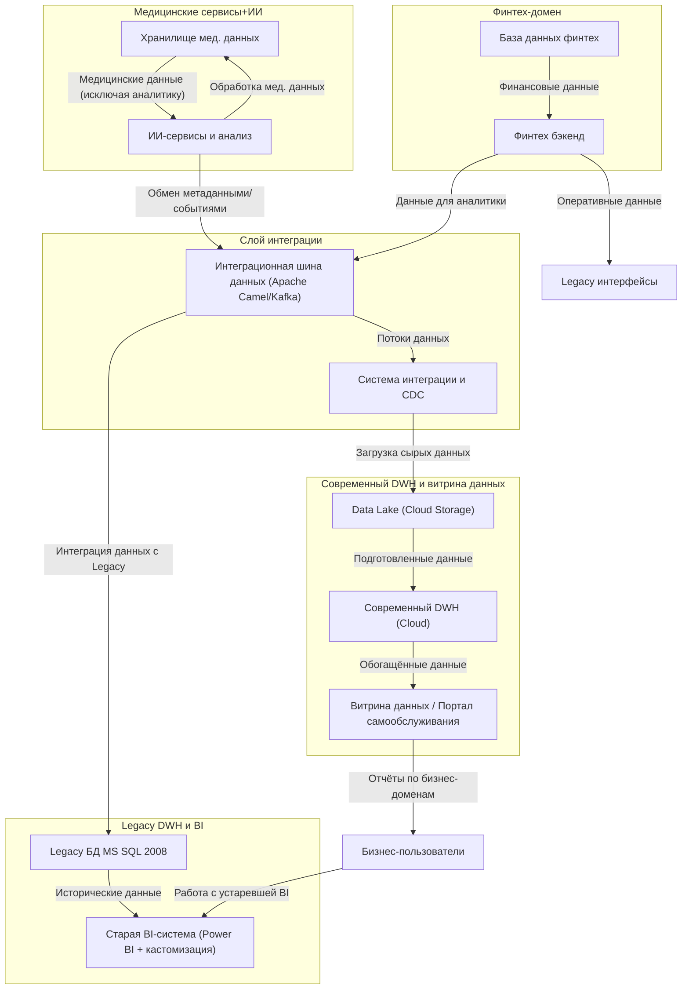

# Задание 2. Разделение системы на домены и Data Flow Diagram

## Разделение на домены

1. **Медицинские сервисы и ИИ**  
   - Хранение и обработка медицинских данных (медкарты, истории болезни, результаты исследований).  
   - ИИ-сервисы для медицины: анализ данных, машинное обучение.  
   - Отсутствие аналитики в витрине данных по этим данным (соблюдение privacy и регуляций).

2. **Финтех-домен**  
   - Обработка финансовых услуг, транзакций, кредитов, счетов.  
   - Своя база данных и backend-сервисы.

3. **Современный аналитический DWH и витрина данных**  
   - Хранение агрегированных и трансформированных данных для аналитики по всем бизнес-доменам, кроме медицинских данных.  
   - Витрина данных для самостоятельного построения отчетов сотрудниками.  
   - Обеспечение высокопроизводительной и масштабируемой аналитики.  
   - Исключение из DWH бизнес-логики, минимизация трансформаций в базе.  

4. **Data Lake (сырые и интегрированные данные)**  
   - Хранение сырых данных из всех систем и доменов для обеспечения историчности и инновационных сценариев.  

5. **Слой интеграции и обмена данными**  
   - Интеграционная шина и CDC решения для передачи данных между доменами и DWH/Data Lake.

6. **Legacy DWH и BI-система (на этапе миграции)**  
   - Поддержка устаревшей платформы для существующих процессов до полного перехода.

## Data Flow Diagram (DFD) — Потоки данных между доменами

## Аргументация логики разделения на домены

- **Изоляция бизнес-доменов**: Медицинский домен отделён от финансового и аналитического, что позволяет независимое развитие с учётом специфики данных и регуляций (например, конфиденциальность и compliance для медданных). Это снижает риски и упрощает поддержание.

- **Архитектура Data Mesh**: Каждый домен обладает ответственностью за собственные данные и бизнес-логику. Это предотвращает рост монолитной бизнес-логики в DWH и облегчает масштабирование и развитие каждого направления без влияния на другие.

- **Современный DWH без бизнес-логики**: В результате исключения бизнес-логики из DWH достигается значительный прирост производительности, упрощается масштабирование и развитие архитектуры. DWH становится платформой для хранения обработанных данных для центральной витрины — самообслуживания.

- **Data Lake как единый слой хранения**: Позволяет хранить сырые данные и работать с ними в гибком режиме — для новых запросов, ML, несрочной аналитики. Это упрощает расширение новых бизнесов и интеграцию новых типов данных.

- **Отказ от legacy-систем**: Негативные эффекты старых систем (SQL Server 2008, Power BI с кастомизациями) устранены на длительную перспективу, позволяя компании быстрее развиваться и снижать операционные затраты.

- **Интеграционная шина и CDC**: Обеспечивают потоковую передачу данных, снижая задержки и повышая актуальность данных в аналитике, а также упрощая подключение новых систем без изменения основного DWH.

- **Пользовательская витрина**: Портал самообслуживания повышает agility бизнес-пользователей и снижает нагрузку на ИТ, раскрывая потенциал данных для принятия решений.
