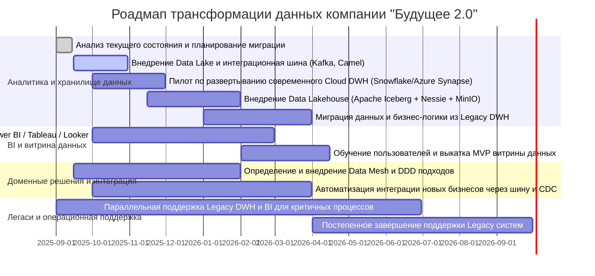

# Технический радар, роадмап и обоснование изменений для компании «Будущее 2.0»

## Технический радар

| Категория           | Технологии и методологии                            | Описание                                                                                              | Статус                |
|---------------------|----------------------------------------------------|------------------------------------------------------------------------------------------------------|-----------------------|
| Платформа DWH       | MS SQL Server 2008                                 | Legacy DWH, устаревшая, медленная, сложно масштабируемая                                            | Hold                  |
| Современный DWH     | Snowflake, Azure Synapse, Redshift                 | Облачные DWH без бизнес-логики, оптимизированные под аналитические нагрузки                         | Adopt                 |
| Data Lake           | Azure Data Lake, Amazon S3, MinIO                   | Облачное хранилище для сырых и интегрированных данных                                              | Adopt                 |
| Data Lakehouse      | Apache Iceberg, Delta Lake, Apache Hudi             | Расширяет Data Lake ACID-семантикой, транзакциями, оптимизация хранения и обработки данных         | Trial/Adopt            |
| Интеграционная шина | Apache Camel, Kafka                                 | Шина передачи событий и данных, CDC для актуализации данных в системе                              | Adopt                 |
| BI-платформа        | Power BI, Tableau, Looker, собственные решения     | Портал самообслуживания, поддержка самостоятельной генерации отчетов с контролем доступа           | Adopt                 |
| Медицинские сервисы | Python, ML-сервисы                                  | Специализированная обработка и анализ медицинских данных без интеграции в аналитический DWH        | Adopt                 |
| Финтех-сервисы      | Java, Golang                                        | Backend и базы данных для финансовых операций                                                      | Adopt                 |
| DevOps / CICD       | Jenkins, GitLab CICD, SonarQube                     | Автоматизация тестирования, сборки и развертывания                                                 | Adopt                 |
| Методологии         | Data Mesh, DDD, Privacy by Design                   | Архитектурные подходы для децентрализации ответственности за данные и соблюдения регуляций         | Trial/Adopt            |
| Технологии Stream   | Kafka, Debezium                                     | Для реализации CDC и потоковой интеграции данных                                                   | Adopt                 |
| Catalog / Metadata  | DataHub, Nessie                                     | Управление метаданными и версиями данных, поддержка lineage и compliance                           | Trial/Adopt            |

## Роадмап изменений технологического ландшафта 

## Обоснование этапов роадмапа

- **Анализ текущего состояния и планирование миграции:** Необходим для понимания существующих проблем легаси-системы и определения приоритетов с учетом бизнес-потребностей и MoSCoW-принципа. Формирует базу для последующих этапов.

- **Внедрение Data Lake и интеграционной шины:** Ключ к масштабируемому хранению данных в сыром и интегрированном виде, а также к безопасной и быстрой интеграции разных бизнес-доменов через события и CDC.

- **Пилот современного Cloud DWH:** Позволяет оптимизировать хранение и аналитическую работу без бизнес-логики, повышая производительность и снижая временные издержки на построение отчетов.

- **Внедрение Data Lakehouse:** Комбинирует достоинства Data Lake и DWH, добавляя транзакционность и обеспечение качества данных, что критично при работе с большими объемами.

- **Миграция из Legacy DWH:** Постепенный перевод данных и логики в новые системы без остановки бизнеса, снижение технического долга и упрощение поддержки.

- **Разработка портала самообслуживания:** Выполняет запрос бизнеса на agile и самостоятельную аналитику без привлечения IT, снижая время до принятия решений.

- **Обучение и выкатка MVP:** Обеспечивает адаптацию корпоративных пользователей к новым инструментам и подтверждает практическую пользу изменений.

- **Внедрение Data Mesh и DDD:** Позволяет разделить ответственность и бизнес-логику между доменами, снижая сложности масштабирования и кастомизации.

- **Автоматизация интеграции новых бизнесов:** Упрощает подключение новых систем, снижая необходимость писать кастомную логику в центральном DWH.

- **Поддержка и снятие Legacy:** Обеспечивает стабильность существующих процессов в переходный период и минимизирует риски при миграции.
